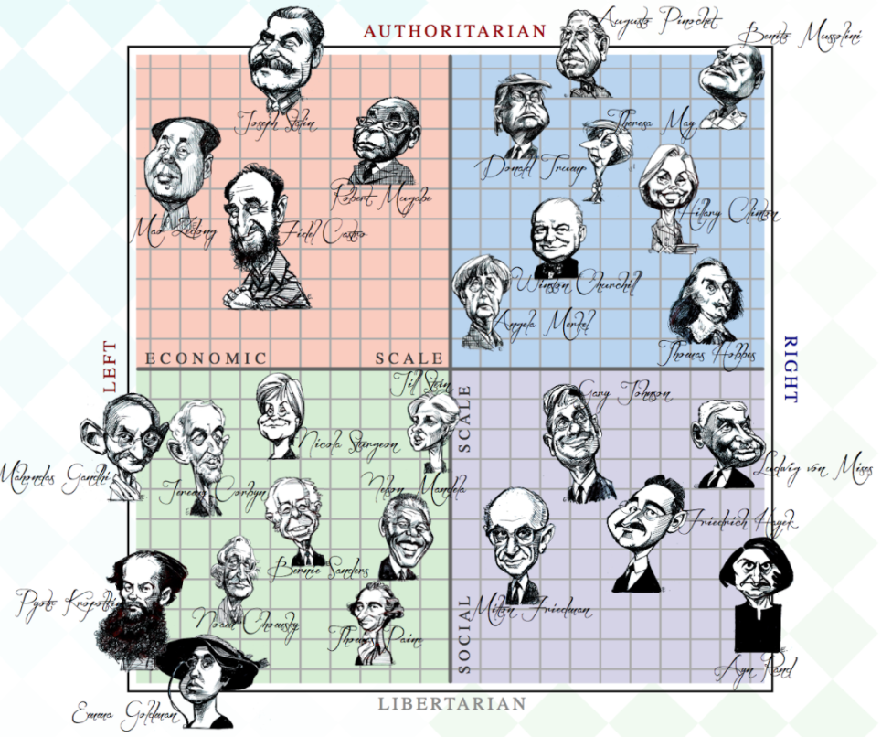
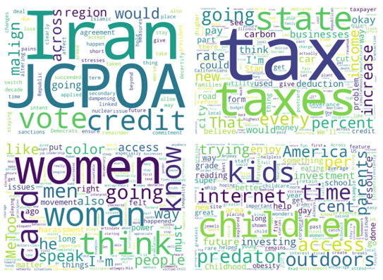

Ever since the dawn of democracies, political scientists have been searching for the fundamental axes that best define our political beliefs. Are you progressive or conservative? Authoritarian or liberal? Do you favour small or big government? In order to represent such divisions, graphical representations known as "political compasses" have been created, which show where different people lie according to a set of questions that are believed to best characterise the political debate and capture the orientation of an individual.

 © PACE NEWS LTD 2021  

Traditionally, all these compasses are built using 2 axis: a horizontal left-right econonomic scale, and a vertical authoritarian-libertarian social scale. But do these axes really define accurately the political divide of today, when political affiliations are shifting and traditional sticking points no longer hold?

To find it out, we analyze [Quotebank](https://zenodo.org/record/4277311), a dataset of ~180 milion quotations extracted from english news articles published between 2008 and 2020. Let's begin our journey!
<!--Here we could add some example e.g. Conservatives in the UK raising taxes and giving out a lot of welfare when they were always a small-state party; democrats getting support from college-educated americans despite traditionally being a party of the working class (same with labour in the UK); rise of non-traditional parties such as En Marche in France or various parties (northern league, 5* movement) in Italy that have largely replaced the traditionally dominant christian democrats;etc-->



For simplicity, we decided to focus only on quotes attributed to alive American politicians, published between 2015 and 2020. We decided to focus only on the US to reduce the impact of local, country-specific topics, and to have a well-known framework of investigation as the US political system is. After filtering with said criteria, we are left with 9.5 million quotes from 14'000 different speakers. Let's now have a look at what it is that these politicians talk about – but before we do, let's see who they are!

### The Silent Majority

Looking at the politicians with the most quotes, we can see evidence of what statisticians call a "power law" (commonly also known as the [80-20 rule](https://en.wikipedia.org/wiki/Pareto_principle)): few most quoted politicians completely dominate the debate, in spite of all the others. The most quoted politician, Donald Trump, accounts alone for almost 8% of all the quotes. To understand just how dominant that is, consider that if the quotes were uniformly distributed among our 14k politicians, an average politician should only account for 0.007% of the quotes! Indeed, our data even trump the 80-20 rule, as the top 20% of politicians account for almost 88% of the quotes. This shows that, in today's world, few of the loudest politicians completely dominate media coverage, while the majority of politicians are given very little attention. Hence, we are seeing confirmation of the existence of a [silent majority](https://en.wikipedia.org/wiki/Silent_majority) that does not express its views publicly, or does so with little to no coverage.

<embed type="text/html" src="assets/plotly/number_of_quotes.html" width="1000px" height="600px">

### Dominant Topics

Having examined the politicians behind the quotes, let's now investigate their content. To do so we use a tool called [BERTopic](https://maartengr.github.io/BERTopic/index.html), which allows us to learn and extract the topics that best characterise our quotes, leading us to the top 1000 significant topics [^1]. Of course, 1000 topics is a bit too many to interpret and to create a political compass, so we will need to reduce this down further. Before we do, let's get some insights about what the most significant topics are!

<!-- some kind of plot? -->

Amongst the 10 topics with most quotes, many are uncannily familiar: Hillary Clinton, Iran, Womens' Rights, Taxation or Youth.

> We have to tell young people that it does matter, every vote counts!
>
> – <cite> Most representative quote for the "Youth" topic </cite>

These topics are the ones which are most talked about, but are they also most divisive? Let's find out!

    

### Divisive Topics

To analyze which topics divide politicians, we first need to get their sentiment towards each topic. For example, do they feel positive or negative towards Hillary Clinton or Womens' Rights? To do this, we used [VADER](https://github.com/cjhutto/vaderSentiment) to assign to each quote a score between -1 and 1, corresponding to an expressed sentiment ranging from negative through neutral to positive. Then, we averaged those scores on each topic to extrapolate an **opinion** for each speaker in our dataset, capturing his overall views and beliefs[^2].

Then, we focused on the Republican/Democratic divide. On which topics do their sentiments differ the most?

<embed type="text/html" src="assets/plotly/bubbleplot.html" width="810px" height="720px">

In the figure above, the 10 topics that most divide democrats and republicans are represented as dots. The larger the dot, the more the topic is talked about in the news: for example, Brett Kavanaugh received a lot of attention. Most points topics are on the top left of the graph, hence Republicans have often a more positive sentiment than Democrats on the top 10 divisive topics. Indeed, half of these topics are about Republican politicians, so it's a reasonable result!

The analysis shows that most divisive topics are in fact not topics of long-term vision for the country but rather concerning transient issues that we could label as part of "culture wars" – they are related to particular people who polarized the public debate, such as Mike Pompeo and Mike Pence or the former FBI director Jim Comey. Interestingly, a topic about former president Donald Trump is not present. The only long-term topic out of the most divisive ones is the 'Rejection of Paris accord', which unsurprisingly triggered positive sentiments from republicans. Another interesting finding is that 2 out of the top 10 most divisive topics are Trump-appointed Supreme Court Justices, Kavanaugh and Gorsuch, showing the politicization of the Supreme Court which has become a powerful player in a country with blocked legislature. Finally, we don't see among these topics any Democrats personality, but since the period under study (2015-2020) largely corresponds to Donald Trump's presidency, it is reasonable that people in his entourage, either members of the government of his appointees, received more attention than others.
<!--{'920': 'Mike Pompeo','380': 'Mike Pence','558': 'Judge Neil Gorsuch','680': 'John Bolton','143': 'Kavanaugh family','208': 'FBI and Jim Comey','360': 'FISC, Adam Schiff','566': 'Rejection of Paris accord','615': 'Marco Rubio','841': 'Pittsburgh shooting'}-->

Also, it might be interesting to have a look at the sentiments on these topics of some prominent American politicians, whose opinions are generally well-known.

<embed type="text/html" src="assets/plotly/heatmap.html" width="810px" height="720px">

 In the above figure, topics above the line correspond to the 10 most divisive topics. The ones below the line, in <i>italics</i>, are instead some of the most dominant topics.

On average, the sentiments of politicians of each party reflect the party sentiments showed before, and for specific people it corresponds very well to what we would expect. For example, Hillary Clinton has a very negative sentiment towards Republican politicians and appointees or towards the [Pittsburgh shooting](https://en.wikipedia.org/wiki/Pittsburgh_synagogue_shooting), but has a pretty neutral sentiment towards Paris climate accord, which is coherent with the fact that climate has not exactly been one of her top priorities in the 2016 campaign. On the other side, John McCain has positive sentiments towards his party colleagues, but has a very negative opinion of the Democrat [Adam Schiff](https://en.wikipedia.org/wiki/Adam_Schiff). Despite that, there are also speakers whose sentiments are pretty confusing: why does Joe Biden have such a positive opinion of Mike Pompeo, and why the latter have such a low self-esteem? Overall, though, we can see clearly why these topics are the most divisive ones – the sentiments vary widely between opposite extremes. In contrast, the sentiments of the dominant topics we picked are very mild, and vastly similar for everyone.



Our analyses of the 1000 learned topics yielded interesting results, but clearly having 1000 topics is not exactly practical for a political compass! That is why, as the next step, we reduced them extracting the most important axes of partisan division, which consist of combinations of the above topics that best divide Democrats and Republicans[^3].

### 3 Axes Is All You Need

Firstly, we try to reduce the number of axes to 2, to compare our results to the traditional political compass showed at the beginning.

<embed type="text/html" src="assets/plotly/nca_weighted_2.html" width="810px" height="720px">

However, it's pretty clear that 2 axes are far from sufficient to split the politicians. People standing on completely opposite grounds of the political debate, such as former presidents Trump and Obama, ended up being clustered pretty close together, with everybody else in one large ball of politicians.

<embed type="text/html" src="assets/plotly/nca_weighted_3.html" width="810px" height="720px">

Adding a third axis leads to a vast improvement in results. Suddenly, we can see a clear difference between republicans and democrats, with radicals of both parties such as President Trump or Alexandria Ocasio Cortez appearing on the extremes as outliers, while centrists such as West Virginia Senator Joe Manchin are much more in the middle of the overall distribution of political opinions. While this is in no way conclusive, the result of addition of a third axis supports our original hypothesis that just dividing politicians among two lines is far from sufficient to capture even a simplified version of the complexity of contemporary political divide.

### Offense, player, and Starbucks?

Having extracted the 3 axes that best divide the American political scene and found out that they work surprisingly well and preserve many semantics of the real political divide (e.g. Republicans and Democrats divide being clearly visible, moderates being closer to each other while radicals being further apart, etc), you are now surely as keen as we are to explore what the meaning of the axes is! Let's check it out!

> Guns, Airports, Paul Ryan, Police officiers, Gangs
>
> – <cite> Five most representative topics for Axis 3 </cite>

Closer inspection gives a clear indication on some axes but not on others. Let's consider them starting from the 3rd axes, the one that truly achieves separation of political parties. The number one most important topic here is an all too familiar topic – gun control –, followed by topics that have to do with policing such a "police officers" or "gangs". Interestingly, attitude towards speaker of the house [Paul Ryan](https://it.wikipedia.org/wiki/Paul_Ryan) also seems to be strongly included, which might be because of his view on the above topics. Overall, we suppose this axis could be labelled the **law and order axis** – do politicians believe that people should have the right to defend themselves? Should the police be a repressive force punishing wrongdoings or rather a progressive force fighting for social good?

> President, Guns, Safety, Sanctuary cities, Governor
>
> – <cite> Five most representative topics for Axis 1 </cite>

The first axes could perhaps be best described as the **authoritativeness** axes, interestingly in correspondence with the traditional political compass. Topics here include mostly attitudes towards positions of power, number one topics concerns presidents (both American and Chinese), others include governors, or [sanctuary cities](https://en.wikipedia.org/wiki/Sanctuary_city) (municipalities that have special policies in place to deliberately limit their cooperation with federal immigration agencies).

> Offense, Player, Buildings, Right History, Starbucks
>
> – <cite> Five most representative topics for Axis 2 </cite>

Finally, the second axis is the toughest nut to crack. The best words characterizing the top 5 topics that most contribute in this axis are "offense", "player", "buildings", "right history" and "starbucks". Despite a thorough analysis, we have not been able to find a meaningful interpretation of this axis: who would have though attitudes to sports and starbucks are such a powerful determinant of standing in American politics!

All in all, we have to admit the interpretation of the axes seems more of an art than science. One is completely uninterpretable and the other two both contain gun control as one of the most significant topics. On the bright side, these axes do separate politicians very well so in some sense they do show the real world as it is – but perhaps just like the real world, we do not fully understand them yet. That said, they do clearly highlight the role of gun control, law enforcement and relation to political authorities as some of the most divisive topics of US politics in 2021 with other traditional themes such as economy and taxation nowhere in sight.



Before leaving, let's summarize the key takeaways of our analysis:

- Few politicians completely dominate the public debate – **silent majority** phenomenom does exist!
- Topics politicians most talk about are not the ones where they most disagree – contrary to popular opinion, they agree on many issues!
- Topics that most divide politicians are mostly "culture wars", ephemeral topics that have little to do with a greater vision for the country.
- Most significant axes of todays political division are not clearly interpretable, but they show a clear dominance of topics to do with gun control or law enforcement. The **authoritativeness** axes seems alive and well!
- On the other hand, the traditional **left-right divide** seems dead. Topics that shaped the political debate of the Global North such as government subsidies, taxation, or unions are nowhere to be found.

[^1]: Due to technical limitations, we used only a subset of 600k quotes for learning the topics, assigning then a topic to the remaining quotes with the fitted model. Also, BERTopic initially extracted more than 3000 topics, where each topic was extremely narrow and provided little interpretation possibilities. Hence, the topics were later hierarchically merged to reduce them to the 1000 we employed in the rest of the analysis.

[^2]: From this step, we removed politicians with less than 1000 quotes and that have expressed themselves on less than 150 topics (the 15%), as lower thresholds under which we consider unlikely to obtain a sufficient representation of opinions. If politicians did not express an opinion towards a topic, we left their sentiment as NaN, eventually replacing it with 0 after standardization for further processing.

[^3]: This approach has some clear shortcomings – by maximizing the difference between Republicans and Democrats, we are not taking into account the clear differences that exist within the parties. This applies especially to the democratic party which is particularly fragmented: centrists like Joe Manchin have little in common of with extreme progressives like Alexandria Occasio Cortez. However, out of several dimensionality reduction techniques we have tried, only a supervised method such as [Neighbourhood components analysis](https://en.wikipedia.org/wiki/Neighbourhood_components_analysis) (NCA) gave us interesting results in terms of separation. We also tried using PCA, t-SNE, and UMAP, all unsupervised techniques, but they seemed to focus more on the number of quotes people have rather than their political opinion. This is most likely because despite the fact that we did not explicitly include number of quotes, more quoted politicians expressed a sentiment towards more topics, and they were clustered together in the reduced space as a result. Also, in all the subsequent NCA plots, dimensionality reduction was applied on top of a matrix which in addition to the average sentiment also takes into account the interest in each topic, weighting the sentiment logarithmically with the number of quotes.
